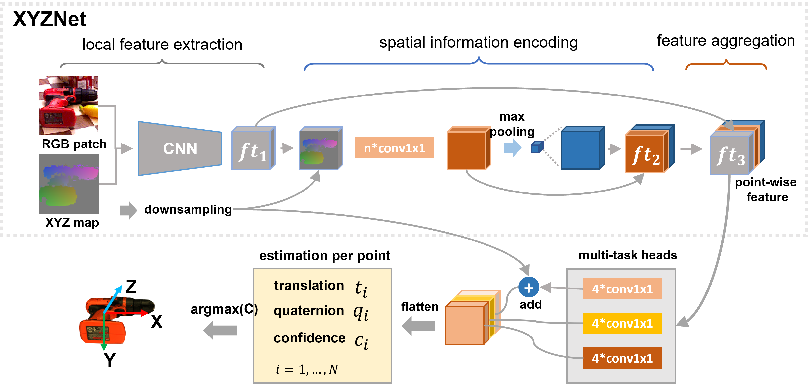

# ES6D (CVPR 2022)

In ES6D, we propose an efficient backbone for real-time instance-level 6D pose estimation. Besides, we propose A(M)GPD to solve the ambiguity problem in the widely used ADD-S metric.
For more details, please check our [paper](https://openaccess.thecvf.com/content/CVPR2022/papers/Mo_ES6D_A_Computation_Efficient_and_Symmetry-Aware_6D_Pose_Regression_Framework_CVPR_2022_paper.pdf), [supplement](https://openaccess.thecvf.com/content/CVPR2022/supplemental/Mo_ES6D_A_Computation_CVPR_2022_supplemental.pdf)
, and [video](https://www.youtube.com/watch?v=C-Feo44VsmA&t=1s). We recommend you use the proposed A(M)GPD metric to train your own model!!! 


|Network architecture
|


### Update
- `2022.06.12`: **Initial release.**
- To do: the experiment details on YCB-Video dataset, the details about the GP construction.    

### Installation
```
git clone git@github.com:GANWANSHUI/ES6D.git
cd ES6D
conda env create -f es6d.yaml
```

## Download: datasets

<details>
  <summary> Directory structure for the download datasets (click to expand; only list used files) </summary>

    datasets
    |-- tless     # http://cmp.felk.cvut.cz/t-less/download.html
    |   |-- train_pbr
    |   |     |-- 000000
    |   |     |     |-- depth
    |   |     |     |-- mask
    |   |     |     |-- mask_visib
    |   |     |     |-- rgb
    |   |     |     |-- scene_camera.json
    |   |     |     |-- scene_gt.json
    |   |     |     |-- scene_gt_info.json
    |   |     |-- 000001
    |   | 
    |   |-- test_primesense
    |   |     |-- 000001
    |   |     |     |-- depth
    |   |     |     |-- mask_visib
    |   |     |     |-- mask_visib_pred // (please find the prediction result from Stablepose)
    |   |     |     |-- rgb
    |   |     |     |-- scene_camera.json
    |   |     |     |-- scene_gt.json
    |   |     |     |-- scene_gt_info.json
    |   |     |-- 000002
    | 
    |
    |-- ycb     # Link: https://rse-lab.cs.washington.edu/projects/posecnn/
        
</details>

## T-LESS

### data pre-processing
```bash
pack each training and testing instance into .mat. 

It may occur the error due to the duplicate file name, just simply retry the order.

-------------------------------------------------------------------------------------------------------------------------------------

$ python ./datasets/tless/tless_preparation.py --tless_path ./datasets/tless --train_set True

If succeed, it will have ./datasets/tless/train_pbr_mat and ./datasets/tless/train_pbr_mat.txt for the dataloader

-------------------------------------------------------------------------------------------------------------------------------------

$ python ./datasets/tless/tless_preparation.py --tless_path ./datasets/tless --train_set False

If succeed, it will have ./datasets/tless/test_primesense_gt_mask_mat and ./datasets/tless/test_primesense_gt_mask_mat.txt for the dataloader

```


### Train
To train `tless` and evaluate testset at the end of training (metric for `add(s)` and `A(M)GPD`), run:

```bash
$ python train.py --loss_type GADD
```

<details>
  <summary> Some messages for the training on T-LESS dataset  </summary>

1. The initial learning rate is set as 0.002, which is much large than the one in the YCB-Video dataset.
2. The training set is a synthesis dataset, so suitable data augmentation could very helpful to improve the performance in the real scenario testing set. For example, we just randomly add some noise to the point cloud and find obvious performance gain. Therefore, more suitable data augmentation could be further investigated.
3. The training strategy is just simply cut down the learning rate after 60 epochs, other learning rate adjustments may more helpful. We train the whole network with 8 NVIDIA 2080TI with 120 epochs and it cost nearly 2 days. But from the loss curve, it should be not necessary to train so many epochs if with a more suitable learning rate strategy.

</details>

### Evaluation
To only evaluate the testset `add(s)` and `A(M)GPD` of the trained `tless` without re-training, please define the checkpoint_PATH and run:
```bash
$ python train.py --test_only True --resume ./experiments/tless/GADD/checkpoint_0120.pth.tar 
```


## YCB-Video (to do)
We post the old version code but still need to update it, but hope that you could find something useful if you urgent to use the GP for your project.


## Acknowledgment
This work can not be finished well without the following reference, many thanks for the author's contribution: 
[DenseFusion](https://github.com/j96w/DenseFusion), [PVN3D](https://github.com/ethnhe/PVN3D), [FFB6D](https://github.com/ethnhe/FFB6D), [Stablepose](https://github.com/GodZarathustra/stablepose_pytorch). 


Please cite ES6D if you use this repository in your publications:
```
@inproceedings{mo2022es6d,
  title={ES6D: A Computation Efficient and Symmetry-Aware 6D Pose Regression Framework},
  author={Mo, Ningkai and Gan, Wanshui and Yokoya, Naoto and Chen, Shifeng},
  booktitle={Proceedings of the IEEE/CVF Conference on Computer Vision and Pattern Recognition},
  pages={6718--6727},
  year={2022}
}
```
